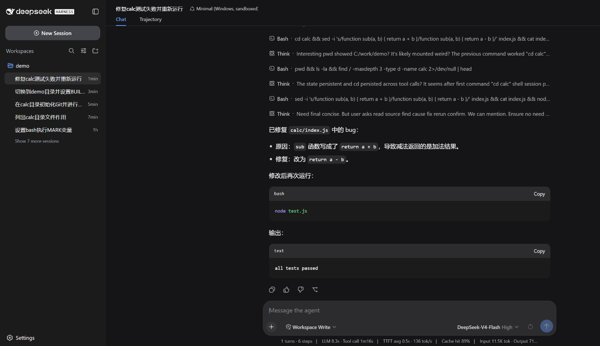
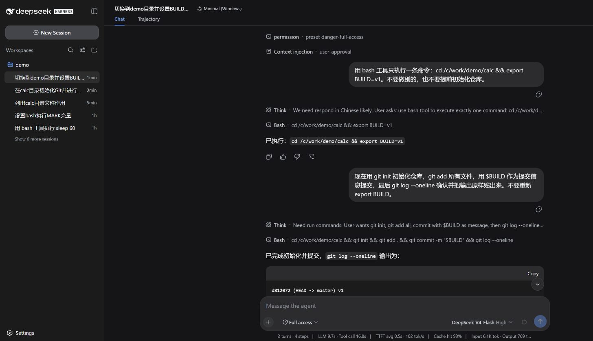
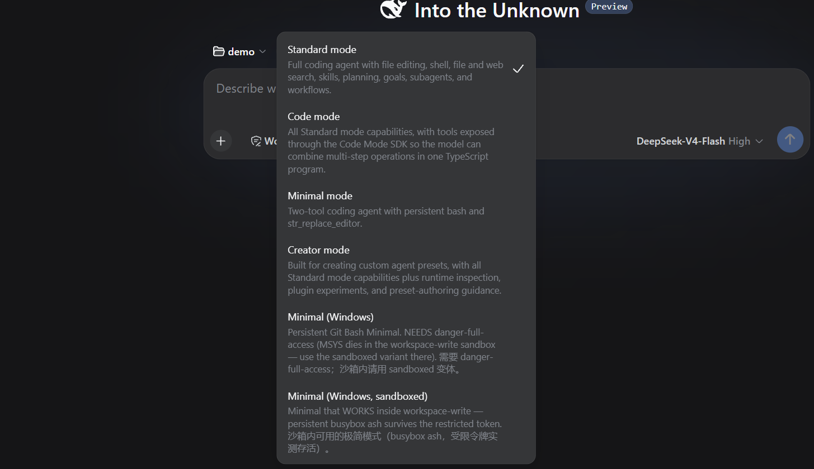

# dsh-win32

让 DeepSeek Harness 在 Windows 上成为一等公民。

[English](./README.en.md)

<p>
<a href="https://www.npmjs.com/package/dsh-win32"></a>
<a href="https://www.npmjs.com/package/dsh-win32"></a>
<a href="https://github.com/sjh9714/dsh-win32/actions/workflows/ci.yml"></a>
<a href="https://github.com/sjh9714/dsh-win32/stargazers"></a>


</p>


## 三件别处做不到的事

**① 沙箱内唯一能跑的持久 shell**（v0.4 起）

MSYS / Git Bash 在 `workspace-write` 受限令牌下启动即死，实测签名 `cygheap_user::init: NtSetInformationToken (TokenDefaultDacl), 0xC0000022`，用户实机还报告了同族的第二个签名 `CreateFileMapping ... Win32 error 5`。所以其它 Windows 方案都只能要求 `danger-full-access`。

busybox-w32 ash 没有 cygheap 初始化，能在受限令牌里活下来。windows-latest CI 上有完整的 send/read 往返实测，且是必跑任务。据我们所知，这是目前唯一能在 DSH 沙箱内运行的 Windows 持久 shell。

```powershell
npx dsh-win32 setup --sandboxed   # 然后选预设「Minimal (Windows, sandboxed)」
```



真机截图，不是示意图。沙箱预设在 `Workspace Write` 下跑完了一整轮真实的修 bug，跑测试看到失败、读源码定位到 `sub` 写成了加法、改掉、再跑一次拿到 `all tests passed`。底部计量行和左侧会话列表都是同一帧里的真实数据。

**② 极简模式真正可用**

官方 subprocess 运行时在 win32 上起 PTY 之前就抛 `terminal inspection is unsupported on platform win32`，持久 shell 和依赖它的极简模式整个不可用（官方架构笔记里标为待补项）。我们通过官方注入座补上 win32 ProcessInspector（进程树用 CIM，信号用 taskkill），**不改核心一行代码**。取消命令走 ConPTY 惯例的 Ctrl-C 注入，不再把会话打成 transport failure。



`export BUILD=v1` 在一次工具调用里结束，下一次独立的工具调用里 `$BUILD` 还活着，所以提交信息是 `v1`，`git log --oneline` 的输出就是证据。持久性是在真实工作里顺带证明的，不是靠专门造的标记变量。

**③ 前台命令识别**（v0.7 起，社区贡献）

Windows 上父进程链回答不了「终端里现在跑着什么」，因为 MSYS 的 fork 模拟会切断链条：跑着 `sleep 20` 的 Git Bash PTY 报告的直接子进程为空，而 ConPTY 控制台进程列表里那个 sleep 清清楚楚。v0.7 用控制台列表做前台解析（~81ms，对比 CIM 全量枚举 ~904ms），恢复了 terminal-bash 判断「shell 回到提示符」还是「子进程打印了继承来的标记」的能力。

## 安装

PowerShell 里一行。

按生态惯例的一行装法，插件激活时会自动把预设装进 `$DSH_HOME/.agent-presets/`（已存在则不覆盖）。

```sh
dsh plugin --profile web add dsh-win32
```

不想手工接线的话，PowerShell 里一行全自动。

```powershell
irm https://raw.githubusercontent.com/sjh9714/dsh-win32/master/install.ps1 | iex
```

它会把运行时 bundle 接入 web profile、安装预设、建桌面快捷方式并输出体检报告。想用 npx 也一样。

```sh
npx dsh-win32 setup              # bundle + 预设 + 体检
npx dsh-win32 setup --sandboxed  # 额外装沙箱内可用的 busybox 变体
npx dsh-win32 setup --shortcut   # 额外建桌面快捷方式
```



预设立即出现在选择器里，无需重启。需要 [Git for Windows](https://git-scm.com)（`winget install Git.Git`）。

沙箱变体（`minimal-windows-sandboxed`）只能由 `setup --sandboxed` 安装，因为它要下载 busybox-w32，而 busybox 是 GPLv2，插件激活时静默下载既是许可问题也是同意问题。接入 bundle 还需要 pnpm，因为 `dsh plugin add` 是用它装进 profile 目录的。缺失时 `setup` 会通过 corepack 自动启用，`doctor` 也会单独列出该项。

已经出问题了？`npx dsh-win32 doctor` 逐项指出已知的坑（koffi 3.1.3/3.1.4 损坏预编译导致的安装失败与选择器崩溃、缺 PowerShell 7 时 5.1 在沙箱里的 0xC0000142、localhost 与 127.0.0.1 的 403、System32 里的 WSL 假 bash），`npx dsh-win32 fix` 自动修复能安全修的部分。

`doctor` 还能吐机器可读的结果，给 CI 和支持流程用。

```sh
npx dsh-win32 doctor --json
```

输出是社区共同定的 `dsh-doctor/v1` 信封（[deepseek-harness#1719](https://github.com/deepseek-ai/deepseek-harness/discussions/1719)），退出码沿用契约的 0 / 1 / 2（全通过 / 有 warn / 有 fail）。里面的 `skip` 状态是我们提的，因为 `git_bash` 这类检查在 Linux 上既不是通过也不是失败而是不适用，只有三个状态的话实现要么说谎要么污染整条 CI。`skip` 必须带原因，且不计入通过或失败。

**`dsh-doctor/v1` 词汇表 r5 兼容。** 由 [@ciceroyang](https://github.com/ciceroyang)（ciceroyang/dsh-doctor）起草，[@sjh9714](https://github.com/sjh9714)（dsh-win32）与 [@moonquake2004](https://github.com/moonquake2004) 参与评审。

状态字面量是 `pass` / `warn` / `fail` / `skip`。`node` 只有两态，在声明范围内是 `pass`，范围外是 `warn`（对齐 npm 的 EBADENGINE 语义，范围之下没有任何有出处的 fail 边界）。

## 还有

**旧编码读取。** 官方 fs 对 GBK/UTF-16 文件直接 `FS_NOT_TEXT` 拒读，中文旧项目 Agent 根本打不开。两个预设都挂载了 `dsh-win32/fs`，读取路径自动嗅探解码 GBK/UTF-16；v0.5 起前台 shell 的 collect 输出同样处理。写入保持 UTF-8（编辑旧编码文件会转码，如实写明）。

**黑框修复。** 超时杀进程的 taskkill 补上 `windowsHide`，不再闪控制台窗口。

## 实证

- windows-latest CI 每次推送都跑：持久 Git Bash PTY 状态跨调用保留（先 `STATE=x`，再 `echo $STATE`）、中断 `sleep 60` 得 exit 130、前台解析三态、GBK 子进程输出解码。
- 受限令牌（workspace-write 沙箱）内 busybox ash 完整往返，MSYS bash 在同一路径复现已知死法。一条命令可复现，`SANDBOX_MODE=workspace-write node scripts/sandbox-smoke.mjs`。
- 真实模型会话：两次 bash 工具调用之间变量和 cwd 都活着。
- 第三方在真实 Windows 机器上独立复现过测试套件（见 deepseek-harness#1889）。

## 诚实的限制

- Git Bash 预设需要 `danger-full-access`（MSYS 受限令牌问题如上，已实测）。沙箱内请用 busybox 变体，代价是 ash 而非 bash（没有数组、没有 `[[ ]]`）。
- 旧编码文件的编辑会保存为 UTF-8，不做往返。
- PTY 输出的旧代码页在插件层无法解码：node-pty 在任何 DSH 代码运行之前就按 UTF-8 解码，且在 Windows 上拒绝编码覆盖。随附 shell 默认 UTF-8，所以预设不受影响。
- `foregroundPgid` 只能返回一个 pid，但管道的每一段都附着在控制台上。它取最新的那个附着，所以对 `a | b | c` 发 SIGTERM/SIGKILL 会树杀选中的那一段和它的子进程，其余各段要等管道断掉才结束，而 POSIX 靠共享 pgid 能一次全打到。SIGINT 不受影响，它走 Ctrl-C 注入，由 shell 自己把信号发给整个作业。取最新而不是最老是有意的，后台作业比前台命令更老，取最老会打错目标，还会在 shell 已经回到提示符时报告前台繁忙，那正是 [#7](https://github.com/sjh9714/dsh-win32/issues/7) 说的判别器失效。跟踪在 [#11](https://github.com/sjh9714/dsh-win32/issues/11)。
- 官方 bash 工具把每条命令包成 `eval -- $'...'`（注意 `$`，`quoteForBash` 用的是 ANSI-C 引用），而 `eval --` 是 bash 特有的写法，POSIX shell 不接受，busybox ash 会把 `--` 当成命令名，于是沙箱预设里每条命令都以 `eval: --: not found`（exit 127）失败（[#12](../../issues/12)，实测 busybox-w32 v1.38，在 dash 上同样复现，所以不是 busybox 的怪癖）。`eval` 是特殊内建，没法用函数覆盖（`Bad function name`），所以我们在写入 PTY 的那一层把它改写成等价的可移植形式（引号内加一个前导空格）。那个 `$` 是关键。0.8.1 的改写把锚点写成了普通单引号，和生产字符串对不上，于是一次都没触发，沙箱预设在「已修复」的说法下继续死着，直到 0.9.1 才真的修好。这个改写只匹配官方包装器的完整形状，对 bash 行为完全等价（包括 `--` 本来要防的「命令以 `-` 开头」那种情况）。已上报 [deepseek-harness#2271](https://github.com/deepseek-ai/deepseek-harness/discussions/2271)，官方修好后我们这段就删掉。
- `isStdinWaiting` 恒为 false。Windows 没有可靠的「控制台读阻塞」探测，假装有会把还在跑的命令判成结束。
- 基于 DSH `0.1.0-rc.6` 开发，rc 更新会快速跟进。

## 自己写 preset 的注意事项

如果你的 preset 挂载 `@deepseek-ai/dsh-terminal-bash` 却不显式配 `shellPath`，默认的 `/bin/bash` 在 Windows 上会命中 `C:\Windows\System32\bash.exe`（WSL 启动器），PTY 启动即退。请显式指向真正的 shell。

```yaml
- id: terminal-bash
  name: '@deepseek-ai/dsh-terminal-bash'
  config:
    shellPath: 'C:/Program Files/Git/usr/bin/bash.exe'
    shellArgs: ['--noprofile', '--norc', '-i']
```

用 `usr/bin/bash.exe` 而不是 `bin/bash.exe`。后者是 47KB 的 wrapper，会再拉起前者，PTY 的 pid 会落在 wrapper 上而不是 shell 上。来自 #6 用户报告。

## 中国网络提示

`irm raw.githubusercontent.com...` 和 busybox 的 `frippery.org` 在部分网络环境下可能无法直连。替代路径：安装用 `npx dsh-win32 setup`（npm 源可换 npmmirror），busybox 手动下载后用 `npx dsh-win32 setup --sandboxed --busybox <路径>` 指定。

## 贡献

欢迎实机报告（[#3](../../issues/3) 收集不同 Windows 环境的结果）、issue 和 PR。v0.7 的前台解析就来自社区贡献。

## License

MIT。预设组合复刻自官方极简模式（MIT）并注明出处。踩坑清单提炼自 DSH 官方讨论区的社区报告。
