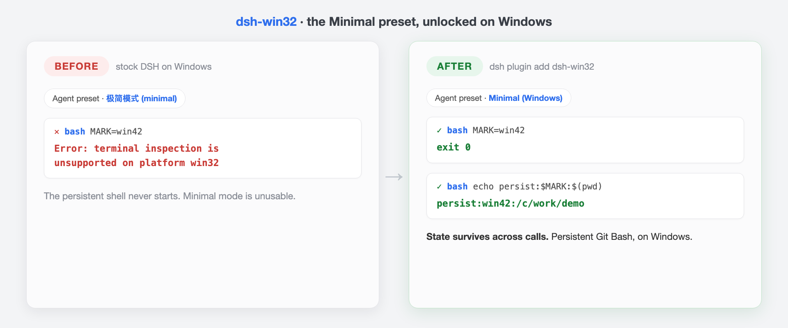

# dsh-win32

让 DeepSeek Harness 在 Windows 上成为一等公民。

[English](./README.md) · [](https://github.com/sjh9714/dsh-win32/actions/workflows/ci.yml)



| | 官方 DSH（Windows） | 装上 dsh-win32 |
|---|---|---|
| 极简模式 | 无法使用。持久 shell 一启动就抛 `terminal inspection is unsupported on platform win32` | **可用。真正的持久 Git Bash，状态跨调用保留** |
| 安装深坑 | koffi 崩溃链、PS 5.1 崩溃循环、localhost 403、System32 假 bash | 一条 `doctor` 命令逐项指出问题和修法 |
| 启动 | 每天早上去 GitHub 找 npx 命令 | `npx dsh-win32 setup`（可选桌面快捷方式） |

## 为什么做这个

社区反复实测说 DeepSeek 模型在 DSH 的极简模式下表现最好。但在 Windows 上，极简模式根本跑不起来：它的持久 bash 需要 PTY，而官方 subprocess 运行时在 win32 上解析平台进程探测器时直接抛错，连 node-pty 都没碰到。所有 Windows 用户都被挡在模型对齐得最好的那个模式之外。

dsh-win32 用三个部分补上这个缺口。

1. **Windows 版 subprocess 运行时。** 与官方运行时完全一致，只补上缺失的 win32 ProcessInspector（进程树与身份用 CIM，信号用 taskkill）。通过 bundle patch 仅在 win32 上替换，其他平台原样保留官方实现。
2. **`minimal-windows` 预设。** 忠实复刻官方极简模式，唯一改动是把 PTY shell 换成你机器上的 Git Bash。同样的完整 persona、同样的双工具、同样不做压缩。
3. **doctor 体检。** 覆盖社区踩过的坑：koffi 3.1.3/3.1.4 损坏预编译（安装失败、目录选择器崩溃、会话保存闪退）、缺 PowerShell 7（5.1 回退在沙箱里 0xC0000142 崩溃循环）、localhost 与 127.0.0.1 的 403、System32 里的 WSL 假 bash。

## 安装

```sh
dsh plugin --profile web add dsh-win32   # 接入运行时 bundle
npx dsh-win32 setup                      # 安装预设 + 输出体检报告
npx dsh-win32 setup --shortcut           # 同上，外加桌面快捷方式
```

预设立即出现在选择器里，无需重启。需要 [Git for Windows](https://git-scm.com)（`winget install Git.Git`）。

## 实证

- CI 跑在真实 `windows-latest` 上：构建运行时、经它拉起持久 Git Bash PTY、验证状态跨写入保留（第一次 `STATE=x`，第二次 `echo $STATE`）。官方运行时在同一任务上必然失败，因为探测器缺口就在启动路径上。
- 单元测试覆盖进程树排序、PID 复用成环、身份匹配、信号映射。

## 诚实的限制（v0.2）

- 长命令中断已通过 Ctrl-C 注入实现（SIGINT/SIGTSTP 作为 PTY 输入，ConPTY 惯例）。对前台进程的 SIGTERM/SIGKILL 在 Windows 上仍不支持，并如实报错。
- Windows ACL 受限令牌沙箱下的行为尚未验证（MSYS 系 shell 在其中已知困难）。如果 `workspace-write` 下 shell 起不来，暂用 `danger-full-access`，等 v0.2。欢迎反馈。
- 基于 DSH `0.1.0-rc.6` 开发。DSH 是开发者预览版，官方已声明会有破坏性变更。版本锁定，每次 rc 更新快速跟进。

## License

MIT。预设组合复刻自官方极简模式（MIT）并注明出处。踩坑清单提炼自 DSH 官方讨论区的社区报告。
