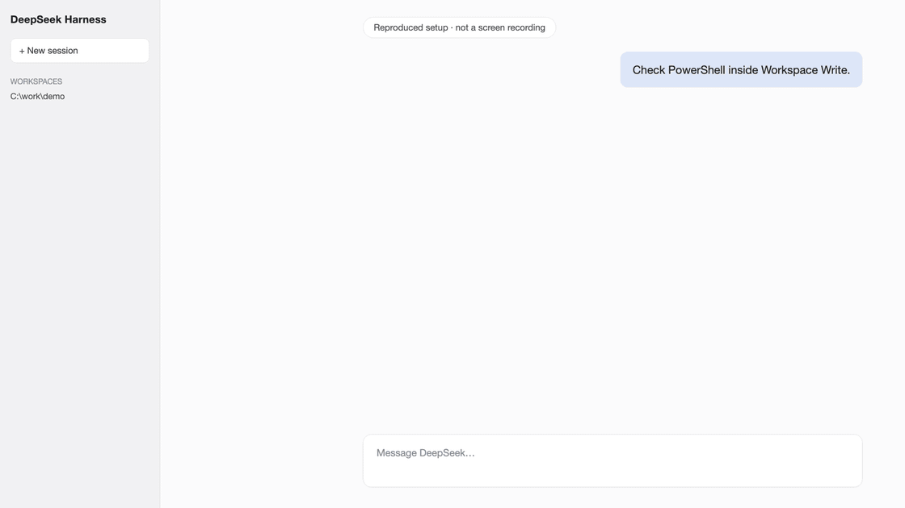

# dsh-win32

## 修好 Windows 上的 DSH，不需要 WSL

**官方 PowerShell。Workspace Write。一条命令。**

```powershell
npx dsh-win32 setup
```

当前版 DeepSeek Harness 已经自带持久 PowerShell 和 Windows ACL 沙箱。dsh-win32 会检查这套官方能力，定位已知的 Windows 故障，只执行能够验证安全的修复，并创建桌面快捷方式。

当前路径不会安装 Git、PowerShell、busybox、WSL，也不会把另一个 DSH bundle 写进 profile。

[English](./README.md) · [Windows 实证与旧版细节](./docs/windows-details.md)

<p>
<a href="https://www.npmjs.com/package/dsh-win32"></a>
<a href="https://github.com/sjh9714/dsh-win32/actions/workflows/ci.yml"></a>
<a href="https://github.com/sjh9714/dsh-win32/stargazers"></a>

</p>

## 当前安装流程

**可复现的安装演示，不是真实录屏。**



这条命令会完成下面的工作。

- 检查官方持久 PowerShell 和 Workspace Write package
- 检查 PowerShell 7 与已知损坏的 koffi runtime
- 为 Web profile 创建 `DeepSeek Harness` 桌面快捷方式
- 不修改官方 profile 和 Minimal 预设
- 输出第一次会话所需的准确步骤

安装后打开 DSH，添加工作区，选择官方 **Minimal**，权限保持 **Workspace Write**。

## 体检与安全修复

```powershell
npx dsh-win32 doctor
npx dsh-win32 doctor --json
npx dsh-win32 fix
```

`doctor` 检查官方 Windows stack 和本机已知故障。JSON 输出遵循 `dsh-doctor/v1`。

`fix` 只处理已知损坏或真实加载失败的 koffi 版本，修复后会再次执行加载验证。

## 旧版 DSH

DSH rc.6 及更早版本没有当前官方 PowerShell stack。原来的 Git Bash 和 busybox 预设仍保留，但必须显式选择。

```powershell
npx dsh-win32 setup --legacy
npx dsh-win32 setup --legacy --sandboxed
npx dsh-win32 doctor --legacy
```

旧版 Git Bash 预设需要 `danger-full-access`。旧版 busybox 预设可以留在 Workspace Write。两个路径都不会自动安装 Git。

## 限制

- 当前路径检查 npm 上发布的 DSH package metadata，不能证明另一个缓存中的 launcher 正在运行同一版本
- 推荐 PowerShell 7，但 dsh-win32 不会自动安装
- 旧版 busybox 会话使用 ash，不是 Bash
- 编辑旧编码文件后会保存为 UTF-8
- 上游 Windows 路径问题修好前，把 `C:\tmp` 视为旧版写入围栏之外

## License

MIT.
